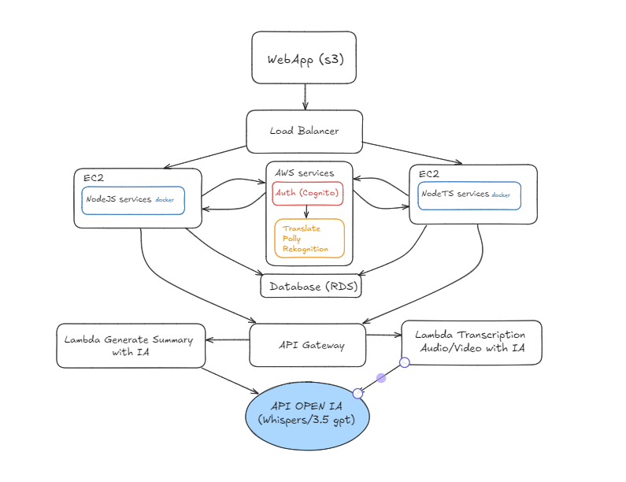
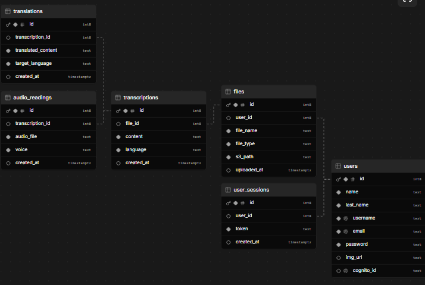
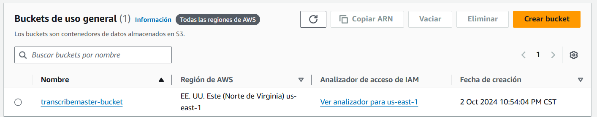
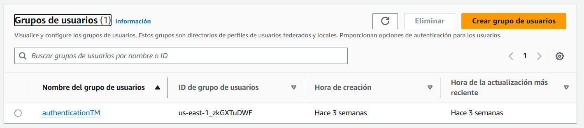
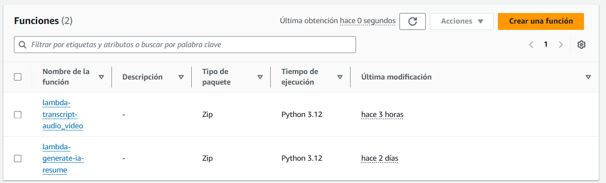
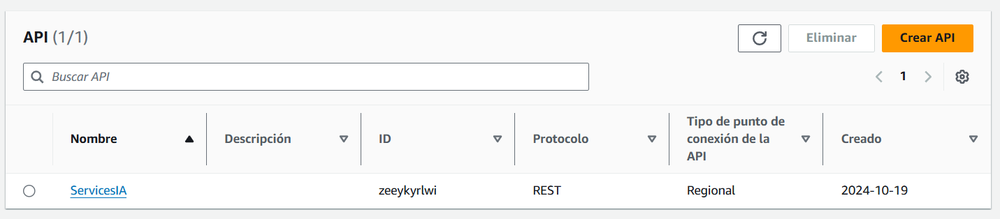
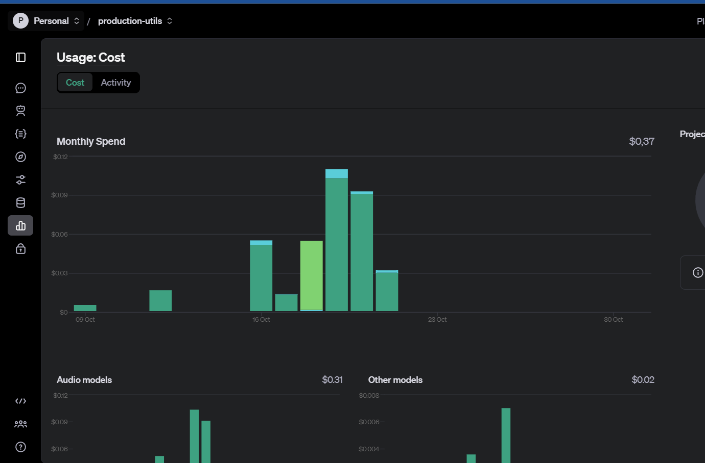

# Proyecto Final - Grupo 12 - Manual de Tecnico

### LABORATORIO SEMINARIO DE SISTEMAS I Sección A

## Objetivos de su proyecto

* **Automatización del proceso de transcripción y traducción de contenido**: Facilitar la conversión de archivos de audio a texto y su posterior traducción, mejorando la accesibilidad y la disponibilidad de contenido en múltiples idiomas.
* **Optimización del almacenamiento y distribución de archivos**: Utilizar servicios en la nube para almacenar archivos de manera segura y distribuirlos de forma eficiente a través de la red, garantizando escalabilidad y disponibilidad.
* **Integración de servicios de inteligencia artificial**: Aprovechar tecnologías como Amazon Rekognition, Translate y Polly para ofrecer análisis avanzado de contenido multimedia, incluyendo reconocimiento de objetos, traducción de texto y generación de audios.
* **Seguridad y control de acceso**: Implementar un sistema seguro para la autenticación y autorización de usuarios, asegurando que solo los usuarios autorizados puedan acceder a los recursos y funcionalidades del sistema.

## Descripción del proyecto

El proyecto consiste en una plataforma que permite a los usuarios cargar archivos de audio, los cuales son transcritos automáticamente y almacenados en la nube. Los usuarios pueden traducir estas transcripciones a diferentes idiomas y generar archivos de audio con la traducción utilizando diversas voces. Los archivos de audio y transcripciones se almacenan en Amazon S3, mientras que los datos sobre las transcripciones y traducciones se gestionan en una base de datos relacional utilizando Amazon RDS.

Además, el sistema emplea servicios de AWS como Rekognition para el análisis de imágenes, permitiendo reconocer objetos y escenas en imágenes relacionadas con los archivos de audio. Utiliza Amazon Translate para la traducción de texto y Amazon Polly para convertir las transcripciones y sus traducciones a audio, permitiendo a los usuarios escuchar las traducciones en diferentes idiomas. Todo esto se complementa con un sistema de autenticación mediante Amazon Cognito, que asegura el acceso seguro a la plataforma.

## Arquitectura implementada del proyecto



## Diagrama de Bases de Datos

Esta base de datos está diseñada para gestionar los aspectos fundamentales de una aplicación web similar a una aplicación para almacenamiento de fotos, utilizando los diferentes servicios de AWS para su implementación. A continuación se detalla el modelo de datos utilizado.



**Script de creación de base de datos**

```
create table users (
  id bigint primary key generated always as identity,
  name text not null,
  last_name text not null,
  username text not null unique,
  email text not null unique,
  password text not null,
  img_url text,
  cognito_id text unique
);

create table files (
  id bigint primary key generated always as identity,
  user_id bigint references users (id),
  file_name text not null,
  file_type text not null,
  s3_path text not null,
  uploaded_at timestamptz default now()
);

create table transcriptions (
  id bigint primary key generated always as identity,
  file_id bigint references files (id),
  content text not null,
  language text not null,
  created_at timestamptz default now()
);

create table translations (
  id bigint primary key generated always as identity,
  transcription_id bigint references transcriptions (id),
  translated_content text not null,
  target_language text not null,
  created_at timestamptz default now()
);

create table audio_readings (
  id bigint primary key generated always as identity,
  transcription_id bigint references transcriptions (id),
  audio_file text not null,
  voice text not null,
  created_at timestamptz default now()
);

create table user_sessions (
  id bigint primary key generated always as identity,
  user_id bigint references users(id) on delete cascade,
  token text not null,
  created_at timestamptz default now()
);
```

## Servicios utilizados

### 1. **AWS EC2 (Amazon Elastic Compute Cloud)**

* Amazon EC2 es un servicio de computación que proporciona servidores virtuales escalables en la nube. Permite a los usuarios lanzar y gestionar instancias de máquinas virtuales (VMs) para ejecutar aplicaciones de manera flexible.
* **Características principales**:
  * Escalabilidad horizontal y vertical según las necesidades de carga.
  * Diferentes tipos de instancias que se adaptan a cargas de trabajo específicas (por ejemplo, optimizadas para computación, memoria, almacenamiento).
  * Integración con otros servicios de AWS como S3, RDS, y ELB.
* **Uso en el proyecto**: EC2 fue utilizado para alojar la aplicación backend del proyecto. Las instancias de EC2 manejan la ejecución de la API construida con Node.js, facilitando la integración con otros servicios de AWS, como S3 y RDS. Esto proporciona un entorno escalable y seguro para la ejecución de la lógica de la aplicación.

### 2. **AWS RDS (Amazon Relational Database Service)**

* Amazon RDS facilita la configuración, operación y escalado de bases de datos relacionales en la nube. Es compatible con varias bases de datos como PostgreSQL, MySQL, MariaDB, SQL Server, entre otras.
* **Características principales**:
  * Gestión automática de backups, recuperación ante desastres y parches.
  * Alta disponibilidad a través de réplicas y configuraciones de Multi-AZ.
  * Escalabilidad de almacenamiento y capacidad de procesamiento.
* **Uso en el proyecto**: RDS fue utilizado para alojar la base de datos PostgreSQL, donde se almacenan las transcripciones, archivos, y datos de usuarios. Esto asegura que la base de datos sea altamente disponible y pueda manejar un alto volumen de transacciones de forma eficiente y segura.

### 3. **AWS S3 (Amazon Simple Storage Service)**

* AWS S3 es un servicio de almacenamiento de objetos que permite almacenar y recuperar datos desde cualquier ubicación. Es altamente duradero y escalable, ideal para almacenar grandes volúmenes de datos no estructurados.
* **Características principales**:

  * 99.999999999% de durabilidad y alta disponibilidad.
  * Control granular de acceso mediante políticas de IAM y ACLs.
  * Capacidad de integrar versiones de objetos y ciclo de vida para gestionar el almacenamiento.
* **Uso en el proyecto**: S3 fue utilizado para almacenar los archivos de audio, transcripciones y sus traducciones. Esto incluye el almacenamiento de archivos generados por AWS Polly y los archivos originales subidos por los usuarios. Su integración con otros servicios de AWS facilita el acceso rápido a los datos mediante URLs generadas.

  

### 4. **AWS Load Balancer (ELB - Elastic Load Balancing)**

* ELB distribuye el tráfico de red entrante entre varias instancias de EC2 para asegurar que ninguna instancia se sobrecargue. Ayuda a mejorar la disponibilidad y tolerancia a fallos de las aplicaciones.
* **Características principales**:
  * Balanceo de carga para aplicaciones HTTP/HTTPS y TCP.
  * Soporte para balanceadores de carga de aplicación (ALB), balanceadores de red (NLB) y balanceadores clásicos.
  * Integración con Auto Scaling para ajustar la capacidad según la demanda.
* **Uso en el proyecto**: ELB se utilizó para distribuir el tráfico entrante a través de las instancias de EC2 que ejecutan la API del backend, asegurando que la aplicación sea accesible de manera rápida y balanceada incluso bajo alta demanda. Esto mejora la disponibilidad del servicio y proporciona una mejor experiencia al usuario.

### 5. **AWS Rekognition**

* Amazon Rekognition es un servicio de análisis de imágenes y videos que utiliza inteligencia artificial para identificar objetos, personas, texto, y más en medios visuales.
* **Características principales**:
  * Análisis avanzado de imágenes y videos para detectar etiquetas, rostros, texto, y más.
  * Capacidad de reconocer caras y compararlas con un conjunto de imágenes.
  * Detección de contenido inapropiado o moderación de contenido.
* **Uso en el proyecto**: Rekognition fue empleado para analizar archivos de imagen subidos por los usuarios, por ejemplo, para extraer texto de imágenes (OCR) o identificar objetos específicos. Esto permitió que el contenido visual de los archivos se integrara de manera más profunda en el sistema de transcripciones.

### 6. **AWS Translate**

* AWS Translate es un servicio de traducción automática que permite convertir texto de un idioma a otro utilizando modelos de machine learning.
* **Características principales**:
  * Traducción rápida y precisa entre una amplia variedad de idiomas.
  * Capacidad de integrar traducción en tiempo real en aplicaciones.
  * Facilidad de integración con otros servicios de AWS.
* **Uso en el proyecto**: AWS Translate se utilizó para traducir el contenido textual de las transcripciones a diferentes idiomas solicitados por los usuarios. Esto facilitó que los usuarios accedan al contenido de audio o texto en varios idiomas, mejorando la accesibilidad de la aplicación.

### 7. **AWS Polly**

* AWS Polly convierte texto en discurso natural utilizando voces de alta calidad, lo que facilita la generación de archivos de audio a partir de texto.
* **Características principales**:
  * Soporte para múltiples voces e idiomas.
  * Posibilidad de ajustar el tono y la velocidad del habla.
  * Integración fácil con otros servicios de AWS y APIs.
* **Uso en el proyecto**: AWS Polly fue utilizado para generar archivos de audio a partir de las transcripciones textuales. Esto es útil para crear contenido accesible y permitir que los usuarios escuchen las transcripciones en lugar de solo leerlas.

### 8. **AWS Cognito**

* Amazon Cognito es un servicio de autenticación, autorización y administración de usuarios para aplicaciones web y móviles. Facilita la implementación de inicio de sesión seguro y la gestión de usuarios.
* **Características principales**:

  * Soporte para autenticación a través de proveedores de identidad social como Google, Facebook y Amazon, así como autenticación con usuarios propios.
  * Control de acceso basado en roles utilizando AWS Identity and Access Management (IAM).
  * Funcionalidades para autenticación multifactor (MFA) y gestión de contraseñas.
* **Uso en el proyecto**: AWS Cognito se utilizó para gestionar la autenticación de usuarios y proporcionar un inicio de sesión seguro a la aplicación. Esto permitió manejar tanto la creación de usuarios como la administración de sesiones de manera segura, facilitando la integración con otros servicios de AWS para la autorización de recursos.

  

### 9. **AWS Lambda**

* AWS Lambda es un servicio de computación sin servidor que permite ejecutar código en respuesta a eventos y gestiona automáticamente los recursos de computación necesarios. Solo se paga por el tiempo de ejecución real del código.
* **Características principales**:

  * Integración directa con otros servicios de AWS para responder a eventos (por ejemplo, cambios en S3, eventos de DynamoDB).
  * Capacidad de escalar automáticamente según la carga de trabajo.
  * Soporte para múltiples lenguajes de programación, como Python, Node.js, Java, entre otros.
* **Uso en el proyecto**: Lambda se utilizó para ejecutar tareas específicas sin necesidad de mantener una infraestructura dedicada, como el procesamiento de datos en S3 o la generación de respuestas automáticas. Por ejemplo, se usaron funciones Lambda para procesar archivos subidos a S3 y generar transcripciones automáticas mediante otros servicios de AWS como Polly y Translate.

  

### 10. **AWS API Gateway**

* AWS API Gateway facilita la creación, despliegue y gestión de APIs RESTful y WebSocket. Es un servicio que actúa como puerta de enlace para que los clientes se conecten a las aplicaciones y servicios backend de manera segura.
* **Características principales**:

  * Escalabilidad automática para manejar millones de solicitudes por segundo.
  * Soporte para CORS (Cross-Origin Resource Sharing) y autenticación mediante AWS Cognito o IAM.
  * Integración con AWS Lambda, permitiendo la creación de APIs sin servidor.
* **Uso en el proyecto**: API Gateway fue utilizado para exponer las funciones de la aplicación a través de endpoints RESTful. Esto incluyó la gestión de solicitudes de los usuarios hacia el backend y la integración directa con Lambda para ejecutar lógica de negocio sin necesidad de servidores dedicados. También proporcionó una capa de seguridad al gestionar la autenticación y autorización de las solicitudes.

  

### 11. **Docker**

* Docker es una plataforma de contenedorización que permite empaquetar aplicaciones y sus dependencias en contenedores, garantizando que funcionen de manera consistente en cualquier entorno.
* **Características principales**:
  * Portabilidad y consistencia entre entornos de desarrollo, prueba y producción.
  * Uso eficiente de recursos gracias a la virtualización a nivel de sistema operativo.
  * Capacidad para crear imágenes de contenedores personalizadas que pueden ser compartidas a través de Docker Hub o repositorios privados.
* **Uso en el proyecto**: Docker fue utilizado para contenedorización de la aplicación backend y sus servicios auxiliares, como la base de datos PostgreSQL y otros servicios relacionados. Esto permitió simplificar la gestión de la infraestructura y facilitar el despliegue del proyecto en entornos de desarrollo y producción. También se usó para crear un entorno de desarrollo aislado, evitando conflictos de dependencias.

### 12. **OPEN IA**

* En esta aplicación, hemos integrado los modelos de **OpenAI** a través de funciones **AWS Lambda** para aprovechar la capacidad de procesamiento de **GPT-3.5** y **Whisper**. Estos modelos se encargan de la **generación de transcripciones** a partir de archivos de audio/video y la **generación de resúmenes** a partir de transcripciones largas.

  
