# Proyecto Final - Grupo 12 - Manual de Usuario

### LABORATORIO SEMINARIO DE SISTEMAS I Sección A

## 1. **Registro de Usuario y Verificación por Correo Electrónico**

### Paso 1: Registro

1. El usuario accede a la pantalla de **Registro** donde deberá llenar los siguientes campos:

   - Nombre de usuario
   - Correo electrónico
   - Contraseña
2. Al hacer clic en **Registrar**, el sistema enviará un correo de verificación al email proporcionado. El usuario deberá revisar su bandeja de entrada.

### Paso 2: Verificación de Correo

1. El usuario recibirá un correo con un código de verificación.
2. En la aplicación, si el usuario intenta iniciar sesión sin haber verificado su correo, se le redirigirá automáticamente a la pantalla de **Verificación de Correo**.
3. El usuario debe ingresar el código de verificación en el campo proporcionado.
4. Una vez verificado el correo, el usuario podrá iniciar sesión.

## 2. **Inicio de Sesión**

### Paso 1: Iniciar Sesión

1. Una vez que el correo esté verificado, el usuario podrá iniciar sesión ingresando:

   - Correo electrónico
   - Contraseña
2. Si el correo no está verificado, el usuario será redirigido a la pantalla de **Verificación de Correo** como se explicó anteriormente.

## 3. **Subida de Archivos**

### Paso 1: Acceso a la Función de Subir Archivos

1. Después de iniciar sesión, el usuario tendrá acceso al panel de **Subida de Archivos**.
2. Aquí podrá seleccionar el tipo de archivo que desea subir:
   - **Imagen**
   - **Video**
   - **Audio**

### Paso 2: Subida del Archivo

1. El usuario selecciona un archivo desde su dispositivo y hace clic en **Subir**.
2. El archivo se subirá a un bucket de **AWS S3**, y el sistema comenzará a procesarlo para generar la transcripción, traducciones y audios de manera automática.

## 4. **Proceso de Transcripción, Traducción y Generación de Audios**

### Paso 1: Transcripción Automática

1. Una vez que el archivo se haya subido, el sistema utilizará los servicios de **OpenAI** para generar automáticamente la **transcripción** (para archivos de video o audio).
2. Para imágenes, se usará **AWS Rekognition** para extraer texto de imágenes.

### Paso 2: Traducción Automática

1. Después de generar la transcripción, el sistema utilizará los servicios de **AWS Translate** para generar **traducciones automáticas** en los siguientes idiomas:

   - Español (es)
   - Inglés (en)
   - Francés (fr)
   - Italiano (it)
2. El sistema guardará las traducciones en formato de archivo `.txt` en AWS S3, generando una URL de acceso para cada traducción.

### Paso 3: Generación de Audios

1. El sistema generará audios a partir de las transcripciones utilizando **AWS Polly**, creando archivos de audio en los idiomas mencionados anteriormente.
2. Los archivos de audio estarán disponibles para su reproducción en la aplicación, y cada uno contará con una URL generada y almacenada en AWS S3.

## 5. **Visualización de Resultados**

### Paso 1: Visualización de Archivos

1. El usuario podrá ver una lista de los archivos subidos organizados en **tarjetas** dentro de la sección de:

   - **Imágenes**
   - **Audios**
   - **Videos**
2. Cada tarjeta contiene:

   - **Nombre del archivo**
   - **Tipo de archivo**
   - **Fecha de subida**
   - **Botón para ver detalles** (`Ver Original`), que abre una vista en pantalla completa del archivo.

### Paso 2: Visualización de Transcripciones y Traducciones

1. Al hacer clic en una tarjeta, se abrirá un **modal** donde el usuario podrá:

   - Ver la transcripción del archivo (texto generado).
   - Cambiar entre los idiomas para ver las traducciones.
   - Reproducir los audios generados en los diferentes idiomas.
2. El usuario puede seleccionar la traducción deseada desde un **menú desplegable**, y se cargará el contenido traducido en el área de texto.

### Paso 3: Reproducción de Audios

1. Los audios generados por **AWS Polly** se mostrarán debajo del área de transcripción.
2. Cada audio estará etiquetado con el idioma correspondiente y se podrá reproducir directamente en la aplicación mediante un control de audio.

## 6. **Generación de Resúmenes**

### Paso 1: Generar Resumen

1. Si la transcripción o traducción contiene más de 100 caracteres, el usuario verá un botón adicional que dice **Generar Resumen**.
2. Al hacer clic, se utilizará **OpenAI** para generar automáticamente un resumen de la transcripción o traducción.

### Paso 2: Visualización del Resumen

1. El resumen generado se abrirá en un nuevo **modal** donde el usuario podrá leerlo y, si lo desea, cerrarlo para volver a la vista principal.
2. El proceso es rápido y se realiza en segundo plano, con una animación de carga para indicar que el resumen se está generando.

## 7. **Componentes Interactivos**

### Tarjetas de Medios

- Cada archivo subido se muestra en una **tarjeta** interactiva que contiene una imagen de previsualización para imágenes, un ícono por defecto para videos o audios, y detalles básicos del archivo.
- **Botones**:
  - `Ver Original`: Abre una vista en pantalla completa del archivo original.
  - `Ver Transcripciones y Traducciones`: Abre un modal para mostrar las transcripciones, traducciones y audios generados.

### Modal de Contenido

- El modal que se abre para ver transcripciones y traducciones está diseñado para ser **responsive**, con bordes redondeados y un diseño limpio.
- El contenido del modal incluye:
  - Un área de texto con la transcripción o traducción.
  - Un **menú desplegable** para seleccionar los diferentes idiomas disponibles.
  - Controles de audio para reproducir los audios generados en cada idioma.
  - Un botón para **Generar Resumen** (si es aplicable).

### Animaciones y Diseño UI/UX

- Las animaciones suaves y el diseño limpio se aplican tanto a las tarjetas como a los modales para mejorar la experiencia de usuario.
- Se han utilizado componentes de **Material UI** para garantizar una apariencia moderna y un funcionamiento fluido.

## 8. **Servicios Utilizados**

### OpenAI

- **Transcripción de audio y video**.
- **Generación de resúmenes**.

### AWS

- **S3**: Almacenamiento de archivos, transcripciones, traducciones y audios.
- **Polly**: Generación de audios a partir de las transcripciones.
- **Translate**: Traducción automática de transcripciones a varios idiomas.
- **Rekognition**: Extracción de texto de imágenes.
- Cognito: Autenticación y registro de usuarios.

## Espacio para Imágenes

1. **Registro de Usuario**:

   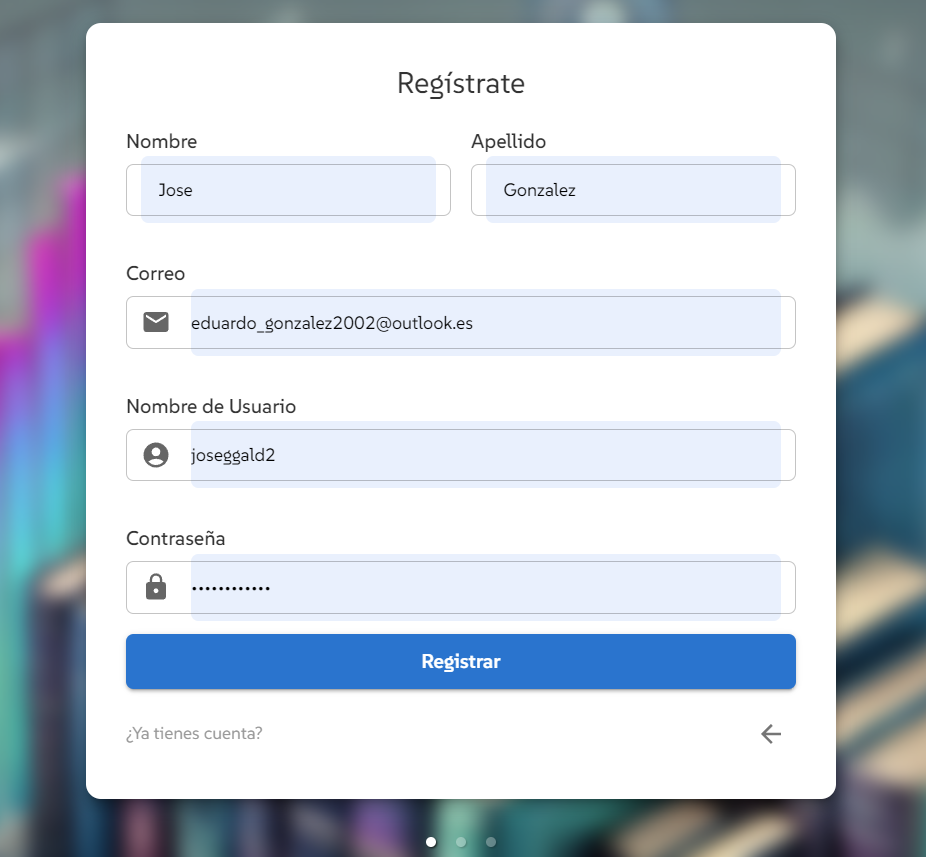
2. **Verificación por Correo**:

   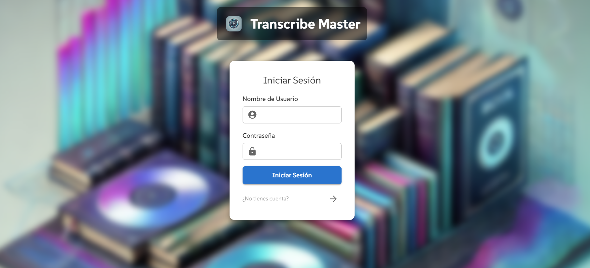_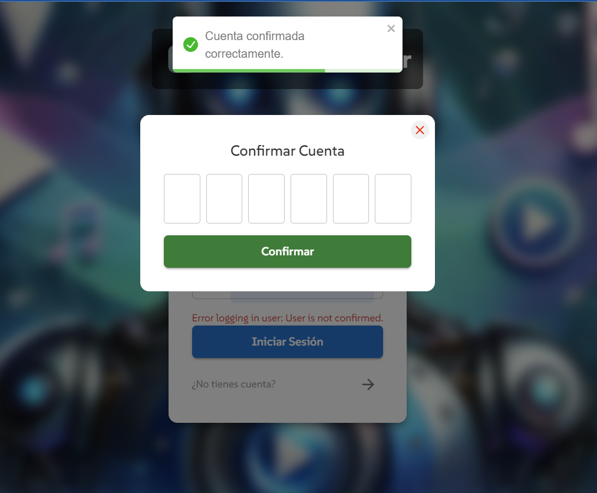
3. **Subida de Archivos**:

   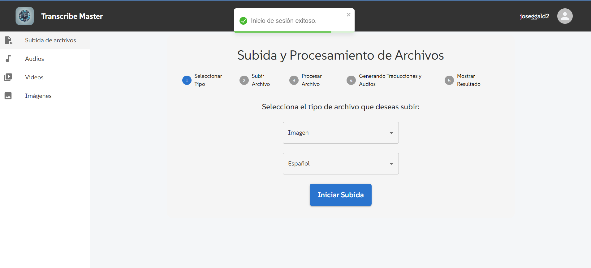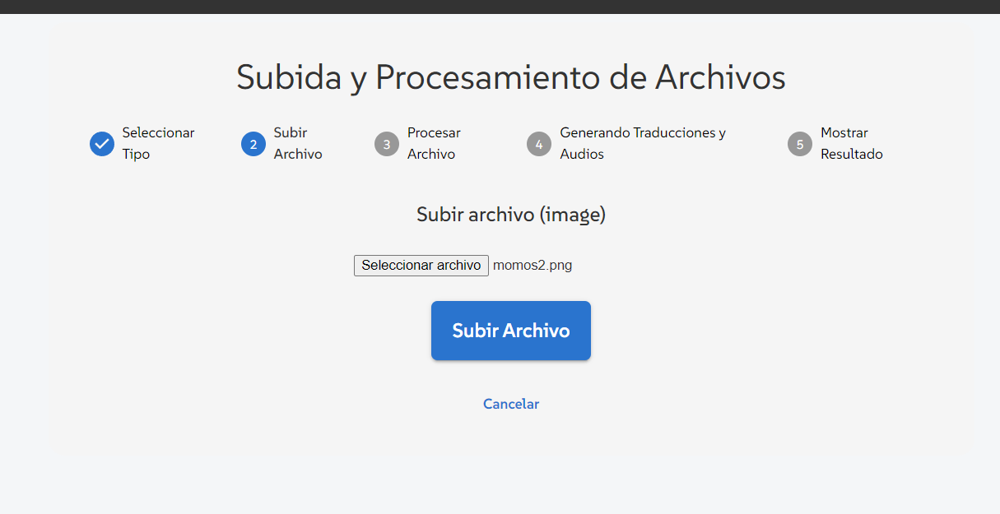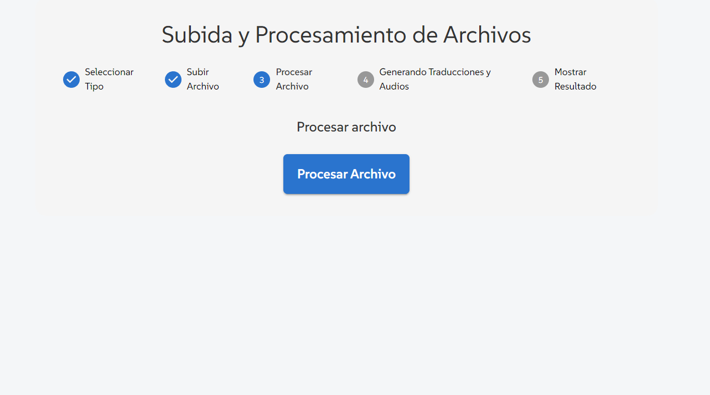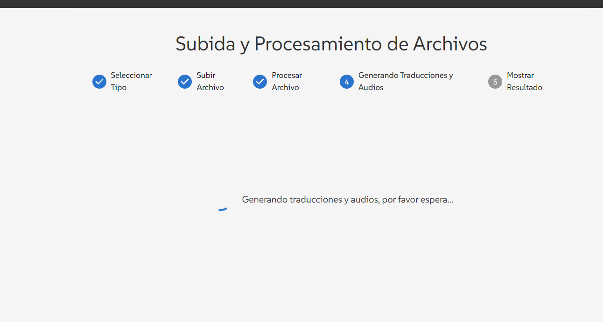
4. **Vista de Resultados**:

   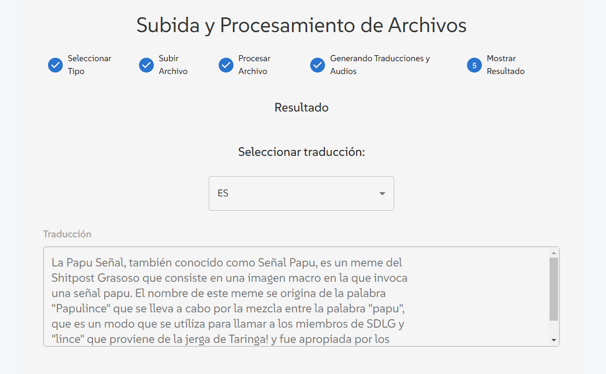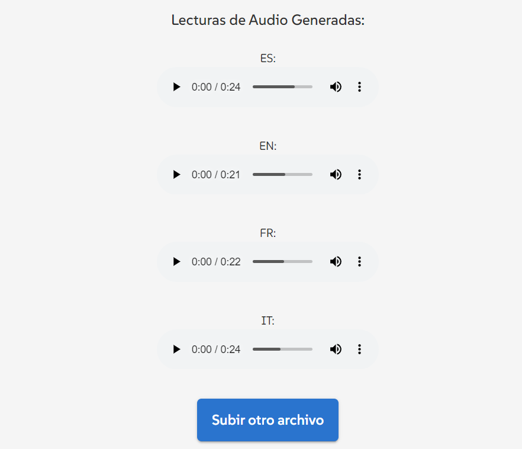
5. **Modal de Transcripción y Traducciones**:

   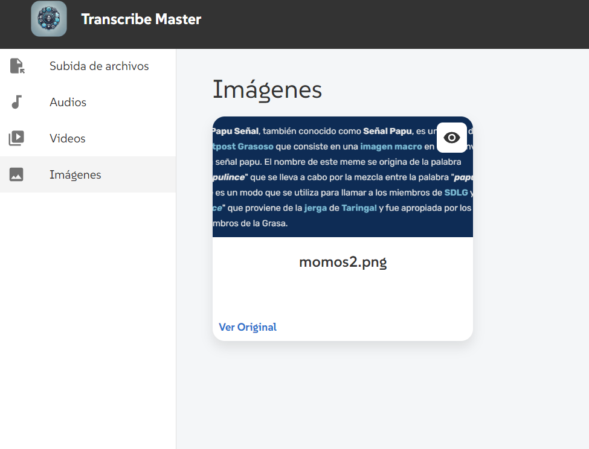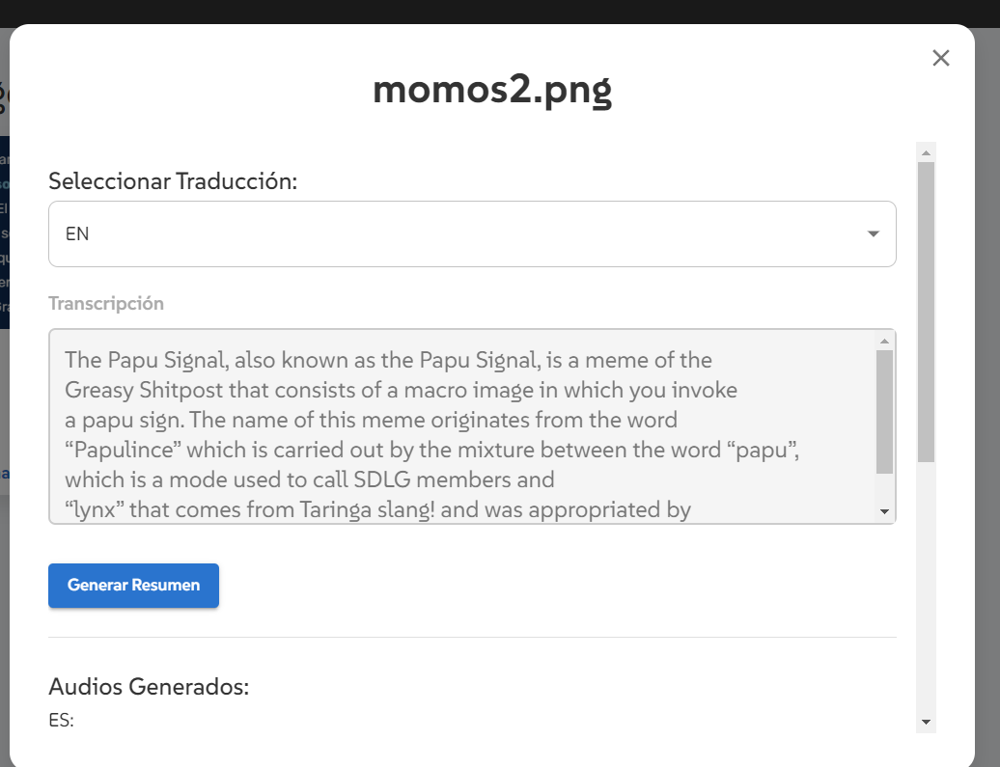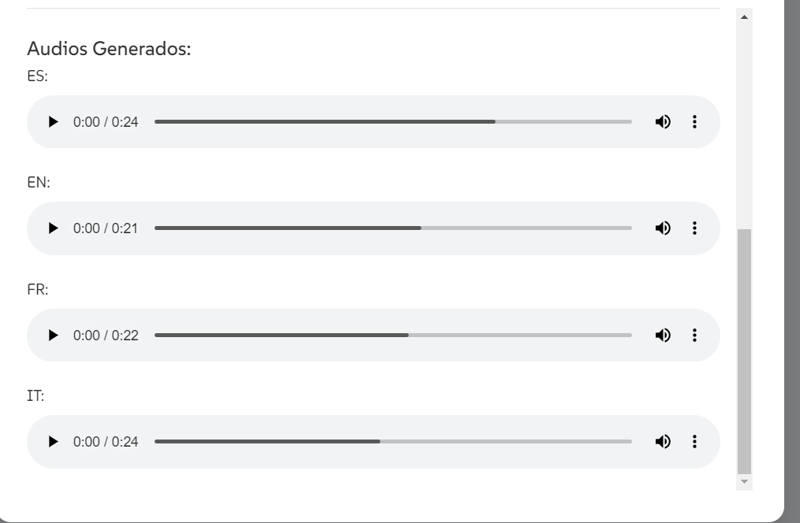
6. **Generación de Resúmenes**:

   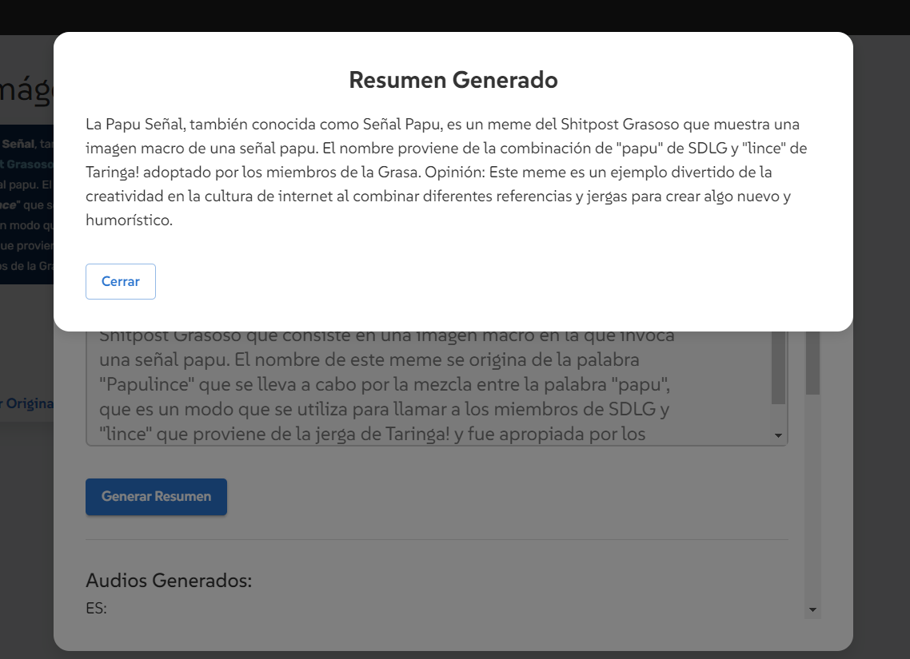
